# Documentación Técnica: Sistema de Pagos - ClutchPay

## Tabla de Contenidos

1. [Visión General del Sistema](#visión-general-del-sistema)
2. [Arquitectura de Pagos](#arquitectura-de-pagos)
3. [Flujos de Peticiones Detallados](#flujos-de-peticiones-detallados)
4. [Diagramas de Flujo](#diagramas-de-flujo)
5. [Validaciones y Seguridad](#validaciones-y-seguridad)
6. [Manejo de Errores](#manejo-de-errores)
7. [Referencias de API](#referencias-de-api)

---

## Visión General del Sistema

ClutchPay es una pasarela de pagos que integra **Stripe** como procesador de pagos (usando PayPal como método de pago) y **PayPal Payouts** para transferir fondos a los receptores. El flujo completo es:

```
Pagador (Deudor) → Stripe Checkout (PayPal) → ClutchPay → PayPal Payout → Receptor (Emisor)
```

### Componentes Principales

- **API Routes**: Endpoints REST para gestión de pagos
- **Stripe Integration**: Procesamiento de pagos mediante Stripe Checkout
- **PayPal Integration**: Transferencias a receptores mediante PayPal Payouts
- **Database (Prisma)**: Persistencia de facturas y pagos
- **Validaciones (Zod)**: Validación de datos de entrada
- **PDF Generation**: Generación de recibos
- **Cloudinary**: Almacenamiento de PDFs

---

## Arquitectura de Pagos

### Stack Tecnológico

```
┌─────────────────────────────────────────────────────────────┐
│                    Frontend (Cliente)                       │
│  (HTML/JS - Peticiones HTTP a API)                         │
└──────────────────┬──────────────────────────────────────────┘
                   │ HTTPS Request
                   ▼
┌─────────────────────────────────────────────────────────────┐
│              Next.js API Routes (Backend)                   │
│  ┌───────────────────────────────────────────────────────┐ │
│  │  /api/payments/*                                      │ │
│  │  - route.ts (GET: Listar pagos)                      │ │
│  │  - [id]/route.ts (GET: Detalle de pago)             │ │
│  │  - stripe/checkout/route.ts (POST: Crear sesión)    │ │
│  │  - stripe/session/[sessionId]/route.ts (GET)        │ │
│  │  - stripe/webhook/route.ts (POST: Eventos Stripe)   │ │
│  └───────────────────────────────────────────────────────┘ │
└──────────────────┬──────────────────────────────────────────┘
                   │
      ┌────────────┼────────────┐
      ▼            ▼            ▼
┌──────────┐ ┌─────────┐ ┌──────────────┐
│  Stripe  │ │ PayPal  │ │  Cloudinary  │
│ Checkout │ │ Payouts │ │   (PDFs)     │
└──────────┘ └─────────┘ └──────────────┘
      │
      ▼
┌─────────────────────────────────────────┐
│     Database (PostgreSQL/Prisma)        │
│  - Users                                │
│  - Invoices                             │
│  - Payments                             │
└─────────────────────────────────────────┘
```

### Modelos de Datos (Prisma)

```typescript
model Invoice {
  id            Int           @id @default(autoincrement())
  invoiceNumber String        @unique
  issuerUserId  Int          // Usuario que recibe el pago
  debtorUserId  Int          // Usuario que paga
  amount        Decimal
  status        InvoiceStatus // PENDING, PAID, CANCELLED, OVERDUE
  payment       Payment?      // Relación 1:1
  // ... otros campos
}

model Payment {
  id              Int           @id @default(autoincrement())
  invoiceId       Int           @unique
  paymentDate     DateTime
  paymentMethod   PaymentMethod // PAYPAL, VISA, MASTERCARD, OTHER
  paymentReference String       // Stripe session ID o payment intent
  receiptPdfUrl   String?
  subject         String
  // ... otros campos
}
```

---

## Flujos de Peticiones Detallados

### 1. Listar Pagos (GET /api/payments)

#### Descripción
Obtiene una lista paginada de pagos filtrados según el rol del usuario autenticado.

#### Flujo de Ejecución

```
┌─────────────┐
│   Cliente   │
└──────┬──────┘
       │ GET /api/payments?role=payer&page=1&limit=10
       ▼
┌─────────────────────────────────────────────────────────┐
│  API Route: /api/payments/route.ts                     │
│                                                         │
│  1. requireAuth()                                       │
│     └─> getServerSession() → Valida JWT                │
│     └─> Si no hay sesión → throw Error('Unauthorized') │
│                                                         │
│  2. paymentListQuerySchema.parse()                     │
│     └─> Valida query params (role, filters, etc.)      │
│     └─> Si inválido → throw ZodError                   │
│                                                         │
│  3. getPagination(searchParams)                        │
│     └─> Extrae page, limit, skip                       │
│                                                         │
│  4. Construir filtros WHERE (Prisma)                   │
│     ├─> role='payer' → debtorUserId = sessionUser.id   │
│     ├─> role='receiver' → issuerUserId = sessionUser.id│
│     ├─> paymentMethod (opcional)                       │
│     ├─> minAmount/maxAmount (opcional)                 │
│     └─> paymentDateFrom/paymentDateTo (opcional)       │
│                                                         │
│  5. db.payment.count() + db.payment.findMany()         │
│     └─> Ejecuta consulta SQL con filtros y paginación  │
│                                                         │
│  6. Calcular totalPages = ceil(total / limit)          │
│                                                         │
│  7. Retornar JSON con meta + data                      │
└─────────────────────────────────────────────────────────┘
       │
       ▼
┌─────────────┐
│  Response   │
│  200 OK     │
│  {          │
│    meta: {  │
│      total, │
│      page,  │
│      ...    │
│    },       │
│    data: [] │
│  }          │
└─────────────┘
```

#### Validaciones Aplicadas

| Validación | Librería | Descripción |
|------------|----------|-------------|
| Autenticación | `requireAuth()` | Verifica sesión activa con NextAuth |
| Query Params | `paymentListQuerySchema` (Zod) | Valida role, paymentMethod, amounts, dates |
| Paginación | `getPagination()` | page ≥ 1, limit entre 1-1000 |
| Rangos | `superRefine()` (Zod) | minAmount ≤ maxAmount, dateFrom ≤ dateTo |

#### Posibles Errores

| Código | Causa | Manejo |
|--------|-------|--------|
| 401 | No autenticado | `handleError()` → JSON con error |
| 400 | Validación fallida | ZodError → JSON con detalles |
| 500 | Error DB o interno | Error genérico |

---

### 2. Obtener Detalle de Pago (GET /api/payments/:id)

#### Descripción
Recupera información completa de un pago específico. Solo el pagador o receptor pueden acceder.

#### Flujo de Ejecución

```
┌─────────────┐
│   Cliente   │
└──────┬──────┘
       │ GET /api/payments/123
       ▼
┌─────────────────────────────────────────────────────────┐
│  API Route: /api/payments/[id]/route.ts                │
│                                                         │
│  1. requireAuth()                                       │
│     └─> Obtiene sessionUser                            │
│                                                         │
│  2. await context.params → { id: "123" }               │
│                                                         │
│  3. Validar ID                                          │
│     ├─> parseInt(id, 10)                               │
│     ├─> isNaN(paymentId) → 400 "Invalid payment ID"   │
│     └─> paymentId <= 0 → 400 "Invalid payment ID"     │
│                                                         │
│  4. db.payment.findUnique()                            │
│     └─> Incluye invoice con issuerUser y debtorUser    │
│                                                         │
│  5. Si payment === null → 404 "Payment not found"     │
│                                                         │
│  6. Verificar autorización                             │
│     ├─> isDebtor = debtorUserId === sessionUser.id    │
│     ├─> isIssuer = issuerUserId === sessionUser.id    │
│     └─> Si !isDebtor && !isIssuer → 403 Forbidden     │
│                                                         │
│  7. Retornar payment completo                          │
└─────────────────────────────────────────────────────────┘
       │
       ▼
┌─────────────┐
│  Response   │
│  200 OK     │
│  {          │
│    id,      │
│    invoice, │
│    ...      │
│  }          │
└─────────────┘
```

#### Validaciones Aplicadas

| Validación | Ubicación | Descripción |
|------------|-----------|-------------|
| Autenticación | `requireAuth()` | Sesión activa |
| ID numérico | Manual (parseInt) | ID debe ser entero positivo |
| Existencia | DB query | Payment debe existir |
| Autorización | Lógica custom | User debe ser debtor o issuer |

#### Posibles Errores

| Código | Causa | Manejo |
|--------|-------|--------|
| 401 | No autenticado | handleError() |
| 400 | ID inválido | JSON con mensaje |
| 404 | Payment no existe | JSON con mensaje |
| 403 | Sin permiso | JSON con mensaje |

---

### 3. Crear Sesión de Checkout (POST /api/payments/stripe/checkout)

#### Descripción
Crea una sesión de Stripe Checkout para pagar una factura. Solo el deudor puede iniciar el pago.

#### Flujo de Ejecución Completo

```
┌─────────────┐
│   Cliente   │
└──────┬──────┘
       │ POST /api/payments/stripe/checkout
       │ Body: { invoiceId: 1, successUrl, cancelUrl }
       ▼
┌────────────────────────────────────────────────────────────────┐
│  API Route: /api/payments/stripe/checkout/route.ts            │
│                                                                │
│  1. requireAuth()                                              │
│     └─> Valida sesión → sessionUser                           │
│                                                                │
│  2. validateBody(stripeCheckoutCreateSchema, body)            │
│     ├─> invoiceId: int, positive                             │
│     ├─> successUrl: URL válida (opcional)                     │
│     └─> cancelUrl: URL válida (opcional)                      │
│                                                                │
│  3. db.invoice.findUnique({ where: { id } })                  │
│     └─> Incluye issuerUser, debtorUser, payment              │
│                                                                │
│  4. Validaciones de negocio                                   │
│     ├─> Si !invoice → 404 "Invoice not found"                │
│     ├─> Si debtorUserId !== sessionUser.id → 403             │
│     ├─> Si invoice.payment existe → 400 "Already paid"       │
│     └─> Si status !== PENDING/OVERDUE → 400 "Cannot pay"     │
│                                                                │
│  5. toCents(invoice.amount)                                   │
│     └─> Convierte decimal a centavos (99.99 → 9999)          │
│                                                                │
│  6. createCheckoutSession() [libs/stripe.ts]                  │
│     ├─> stripe.checkout.sessions.create()                    │
│     ├─> payment_method_types: ['paypal']                     │
│     ├─> line_items: [{ price_data, quantity: 1 }]           │
│     ├─> metadata: { invoiceId, payerId, receiverId, ... }   │
│     ├─> success_url, cancel_url                              │
│     └─> expires_at: +30 minutos                              │
│                                                                │
│  7. Retornar sesión creada                                    │
│     └─> { sessionId, checkoutUrl, invoice }                  │
└────────────────────────────────────────────────────────────────┘
       │
       ▼
┌─────────────────────────┐
│  Response 201 Created   │
│  {                      │
│    sessionId: "cs_...", │
│    checkoutUrl: "...",  │
│    invoice: { ... }     │
│  }                      │
└─────────────────────────┘
       │
       ▼
┌─────────────────────┐
│  Cliente redirige   │
│  a Stripe Checkout  │
└─────────────────────┘
```

#### Librerías y Funciones Utilizadas

```typescript
// Validación de entrada
stripeCheckoutCreateSchema (Zod)
  ├─> invoiceId: z.number().int().positive()
  ├─> successUrl: z.url().optional()
  └─> cancelUrl: z.url().optional()

// Helpers
requireAuth() → Session validation
validateBody() → Zod parsing
toCents() → Decimal to cents conversion

// Stripe integration
createCheckoutSession() [stripe.ts]
  └─> stripe.checkout.sessions.create()
      ├─> Mode: 'payment'
      ├─> Payment method: PayPal only
      ├─> Metadata: Invoice & user info
      └─> Expiration: 30 minutes
```

#### Validaciones en Cascada

```
requireAuth()
    ↓
validateBody(stripeCheckoutCreateSchema)
    ↓
DB: invoice.findUnique()
    ↓
Authorization: debtorUserId === sessionUser.id
    ↓
Business rules:
    - No payment exists
    - Status is PENDING or OVERDUE
    ↓
Stripe API validation (internal)
```

#### Posibles Errores

| Código | Causa | Origen | Manejo |
|--------|-------|--------|--------|
| 401 | No autenticado | requireAuth() | handleError() |
| 400 | Body inválido | Zod validation | ZodError response |
| 404 | Invoice no existe | DB query | JSON message |
| 403 | No es el deudor | Business logic | JSON message |
| 400 | Ya pagada | invoice.payment check | JSON message |
| 400 | Status inválido | invoice.status check | JSON message |
| 500 | Stripe API error | stripe.checkout.sessions.create() | handleError() |

---

### 4. Consultar Estado de Sesión (GET /api/payments/stripe/session/:sessionId)

#### Descripción
Recupera el estado actual de una sesión de Stripe Checkout. Solo participantes pueden acceder.

#### Flujo de Ejecución

```
┌─────────────┐
│   Cliente   │
└──────┬──────┘
       │ GET /api/payments/stripe/session/cs_test_abc123
       ▼
┌────────────────────────────────────────────────────────────────┐
│  API Route: /api/payments/stripe/session/[sessionId]/route.ts │
│                                                                │
│  1. requireAuth()                                              │
│     └─> sessionUser                                            │
│                                                                │
│  2. await params → { sessionId }                               │
│                                                                │
│  3. Validar formato sessionId                                  │
│     └─> Debe empezar con "cs_"                                │
│     └─> Si inválido → 400 "Invalid session ID format"         │
│                                                                │
│  4. getCheckoutSession(sessionId) [stripe.ts]                 │
│     └─> stripe.checkout.sessions.retrieve(sessionId, {        │
│           expand: ['payment_intent', 'line_items']            │
│         })                                                     │
│                                                                │
│  5. Extraer metadata                                           │
│     └─> const metadata = session.metadata as ...              │
│     └─> Si !metadata.invoiceId → 400                          │
│                                                                │
│  6. Verificar autorización                                     │
│     ├─> payerId = parseInt(metadata.payerId)                  │
│     ├─> receiverId = parseInt(metadata.receiverId)            │
│     └─> Si sessionUser.id !== payerId/receiverId → 403       │
│                                                                │
│  7. db.invoice.findUnique() (opcional, info adicional)        │
│                                                                │
│  8. Calcular amount de line_items                             │
│     └─> totalAmount = sum(item.amount_total)                  │
│                                                                │
│  9. Mapear estado con mapSessionStatus()                      │
│     └─> Convierte Stripe status a status interno              │
│                                                                │
│  10. Retornar información de sesión                            │
└────────────────────────────────────────────────────────────────┘
       │
       ▼
┌─────────────────────────┐
│  Response 200 OK        │
│  {                      │
│    sessionId,           │
│    status: "completed", │
│    paymentStatus,       │
│    amount,              │
│    invoice,             │
│    ...                  │
│  }                      │
└─────────────────────────┘
```

#### Funciones de Utilidad

```typescript
// Mapping de estados Stripe a estados internos
mapSessionStatus(session: Stripe.Checkout.Session): StripeSessionStatus
  ├─> 'complete' + 'paid' → 'completed'
  ├─> 'expired' → 'expired'
  ├─> 'unpaid' → 'pending'
  └─> default → 'processing'

// Conversión de centavos
fromCents(cents: number): number
  └─> return cents / 100
```

#### Posibles Errores

| Código | Causa | Manejo |
|--------|-------|--------|
| 401 | No autenticado | handleError() |
| 400 | Formato sessionId inválido | JSON message |
| 400 | Metadata faltante | JSON message |
| 403 | No autorizado | JSON message |
| 404 | Session no existe en Stripe | Error catch específico |
| 500 | Stripe API error | handleError() |

---

### 5. Webhook de Stripe (POST /api/payments/stripe/webhook)

#### Descripción
**Endpoint crítico**: Recibe eventos de Stripe cuando ocurren cambios en el estado del pago. No requiere autenticación (usa firma webhook).

#### Flujo de Procesamiento de Pago Exitoso

```
┌──────────────────┐
│  Stripe Servers  │
└────────┬─────────┘
         │ POST /api/payments/stripe/webhook
         │ Headers: stripe-signature
         │ Body: Event JSON
         ▼
┌────────────────────────────────────────────────────────────────────┐
│  API Route: /api/payments/stripe/webhook/route.ts                 │
│                                                                    │
│  ══════════════════════════════════════════════════════════════  │
│  FASE 1: VERIFICACIÓN DE SEGURIDAD                                │
│  ══════════════════════════════════════════════════════════════  │
│                                                                    │
│  1. await request.text() → payload (raw body)                     │
│                                                                    │
│  2. request.headers.get('stripe-signature')                       │
│     └─> Si falta → 400 "Missing signature header"                │
│                                                                    │
│  3. verifyWebhookSignature(payload, signature)                    │
│     └─> stripe.webhooks.constructEvent()                          │
│     └─> Verifica HMAC con STRIPE_WEBHOOK_SECRET                   │
│     └─> Si falla → 400 "Invalid signature"                        │
│                                                                    │
│  ══════════════════════════════════════════════════════════════  │
│  FASE 2: ROUTING DE EVENTOS                                       │
│  ══════════════════════════════════════════════════════════════  │
│                                                                    │
│  4. switch (event.type)                                            │
│     ├─> 'checkout.session.completed'                              │
│     │   └─> handleCheckoutComplete()                              │
│     │                                                              │
│     ├─> 'checkout.session.async_payment_succeeded'                │
│     │   └─> handleAsyncPaymentSuccess()                           │
│     │                                                              │
│     ├─> 'checkout.session.async_payment_failed'                   │
│     │   └─> handleAsyncPaymentFailed()                            │
│     │                                                              │
│     └─> 'checkout.session.expired'                                │
│         └─> handleSessionExpired()                                │
│                                                                    │
│  ══════════════════════════════════════════════════════════════  │
│  FASE 3: PROCESAMIENTO DE PAGO (checkout.session.completed)       │
│  ══════════════════════════════════════════════════════════════  │
│                                                                    │
│  5. handleCheckoutComplete(session)                                │
│     └─> Si payment_status === 'paid'                              │
│         └─> processSuccessfulPayment(session)                     │
│                                                                    │
│  ══════════════════════════════════════════════════════════════  │
│  FASE 4: PROCESO DE PAGO EXITOSO (processSuccessfulPayment)       │
│  ══════════════════════════════════════════════════════════════  │
│                                                                    │
│  6. Extraer metadata                                               │
│     └─> { invoiceId, payerId, receiverId, ... }                   │
│                                                                    │
│  7. Verificar idempotencia                                         │
│     └─> db.payment.findUnique({ where: { invoiceId } })          │
│     └─> Si existe → return (ya procesado)                         │
│                                                                    │
│  8. Verificar invoice                                              │
│     ├─> db.invoice.findUnique()                                   │
│     ├─> Si no existe → return                                     │
│     └─> Si status === PAID → return (ya pagada)                   │
│                                                                    │
│  ══════════════════════════════════════════════════════════════  │
│  FASE 5: GENERACIÓN DE RECIBO                                     │
│  ══════════════════════════════════════════════════════════════  │
│                                                                    │
│  9. Intentar obtener recibo de Stripe                             │
│     ├─> stripe.paymentIntents.retrieve()                          │
│     ├─> stripe.charges.retrieve()                                 │
│     └─> Si tiene receipt_url → usar esa                           │
│                                                                    │
│  10. Si no hay receipt de Stripe → Generar PDF                    │
│      ├─> generateReceiptPdf() [pdf-generator.ts]                  │
│      │   └─> Genera PDF con PDFKit                                │
│      ├─> Convert to base64                                        │
│      └─> uploadPdf() a Cloudinary                                 │
│                                                                    │
│  ══════════════════════════════════════════════════════════════  │
│  FASE 6: PERSISTENCIA EN BASE DE DATOS (Transacción)              │
│  ══════════════════════════════════════════════════════════════  │
│                                                                    │
│  11. db.$transaction()                                             │
│      ├─> db.payment.create({                                      │
│      │     invoiceId,                                             │
│      │     paymentDate: new Date(),                               │
│      │     paymentMethod: PAYPAL,                                 │
│      │     paymentReference: session.payment_intent || session.id,│
│      │     receiptPdfUrl                                          │
│      │   })                                                        │
│      │                                                             │
│      └─> db.invoice.update({                                      │
│            where: { id: invoiceId },                              │
│            data: { status: PAID }                                 │
│          })                                                        │
│                                                                    │
│  ══════════════════════════════════════════════════════════════  │
│  FASE 7: PAYOUT A RECEPTOR (PayPal)                               │
│  ══════════════════════════════════════════════════════════════  │
│                                                                    │
│  12. createPayPalPayout() [paypal.ts]                             │
│      ├─> Convierte cents a decimal                                │
│      ├─> Genera senderBatchId único                               │
│      ├─> payoutsSdk.payouts.PayoutsPostRequest()                  │
│      ├─> requestBody({                                            │
│      │     sender_batch_header,                                   │
│      │     items: [{ recipient_type: 'EMAIL', ... }]              │
│      │   })                                                        │
│      └─> getPayPalClient().execute()                              │
│                                                                    │
│  13. Si payout exitoso → Actualizar payment                       │
│      └─> db.payment.update({                                      │
│            data: {                                                 │
│              paymentReference: "STRIPE_ID|PAYOUT:BATCH_ID"        │
│            }                                                       │
│          })                                                        │
│                                                                    │
│  14. Si payout falla → Log error (no falla webhook)               │
│      └─> console.error() + TODO: Queue retry                      │
│                                                                    │
│  15. Retornar { received: true }                                   │
└────────────────────────────────────────────────────────────────────┘
         │
         ▼
┌─────────────────────┐
│  Response 200 OK    │
│  { received: true } │
└─────────────────────┘
```

#### Eventos Manejados

| Evento Stripe | Handler | Descripción |
|---------------|---------|-------------|
| `checkout.session.completed` | `handleCheckoutComplete()` | Sesión completada (puede ser async si PayPal) |
| `checkout.session.async_payment_succeeded` | `handleAsyncPaymentSuccess()` | Pago async confirmado (PayPal) |
| `checkout.session.async_payment_failed` | `handleAsyncPaymentFailed()` | Pago async falló |
| `checkout.session.expired` | `handleSessionExpired()` | Sesión expiró sin pago |

#### Validaciones y Seguridad

```typescript
// Verificación de firma webhook (CRÍTICO)
verifyWebhookSignature(payload, signature)
  └─> stripe.webhooks.constructEvent(
        payload,
        signature,
        process.env.STRIPE_WEBHOOK_SECRET
      )
  └─> Valida HMAC SHA-256
  └─> Previene ataques de replay y falsificación

// Idempotencia (evita procesamiento duplicado)
db.payment.findUnique({ where: { invoiceId } })
  └─> Si existe → return early

// Validación de estado de invoice
invoice.status !== PAID
  └─> Evita doble procesamiento
```

#### Integraciones Externas

```typescript
// 1. Stripe (recuperar recibo)
stripe.paymentIntents.retrieve(paymentIntentId)
  └─> stripe.charges.retrieve(chargeId)
      └─> charge.receipt_url

// 2. PDF Generation
generateReceiptPdf(params) [pdf-generator.ts]
  └─> PDFKit para crear documento
  └─> Retorna Buffer

// 3. Cloudinary (subir PDF)
uploadPdf(base64Pdf, folder)
  └─> cloudinary.uploader.upload()
  └─> Retorna URL pública

// 4. PayPal Payouts
createPayPalPayout(params) [paypal.ts]
  └─> PayPal SDK
  └─> Transfiere fondos al receptor
```

#### Manejo de Errores Robusto

```typescript
// Errores de verificación → Rechazar inmediatamente
catch (signature verification)
  └─> 400 "Invalid signature"

// Errores de procesamiento → Log pero no fallar
try {
  processSuccessfulPayment()
} catch (error) {
  console.error()
  return 500 // Stripe reintentará
}

// Errores de payout → No fallar webhook
try {
  createPayPalPayout()
} catch (payoutError) {
  console.error() // Log para admin
  // Webhook sigue exitoso (200)
  // TODO: Implementar cola de reintentos
}
```

#### Garantías de Consistencia

1. **Transacción DB**: Payment + Invoice update en transacción atómica
2. **Idempotencia**: Verifica existencia antes de crear
3. **Reintentos Stripe**: Si webhook falla (500), Stripe reintenta automáticamente
4. **Fallback receipt**: Si Stripe receipt falla, genera PDF custom

---

## Diagramas de Flujo

### Diagrama 1: Flujo Completo de Pago Exitoso

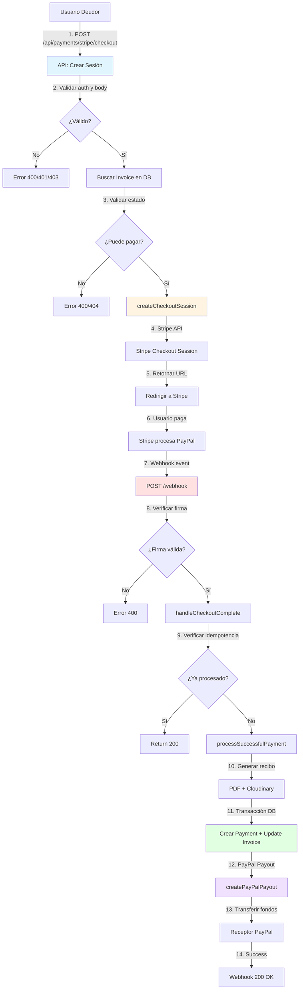

### Diagrama 2: Flujo de Validaciones en POST /checkout

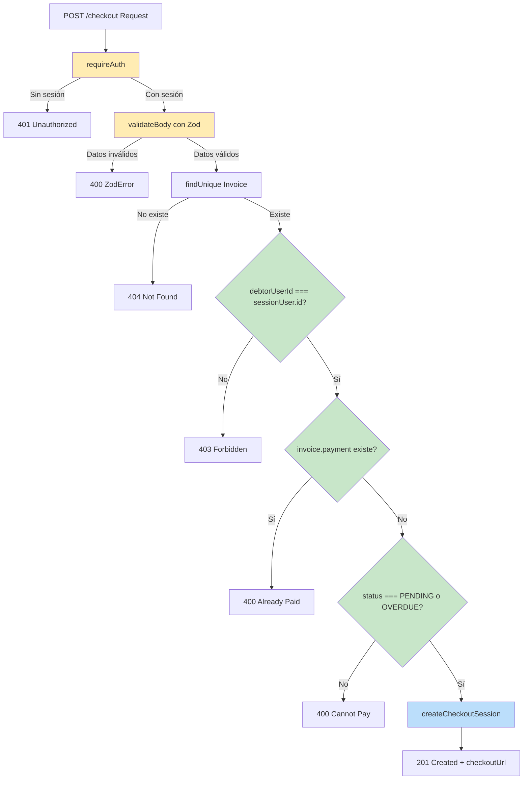

### Diagrama 3: Flujo de Manejo de Errores en Webhook

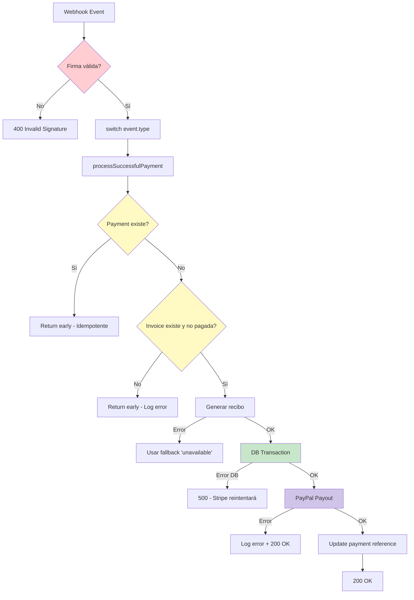

### Diagrama 4: Flujo de GET /api/payments (Listar)

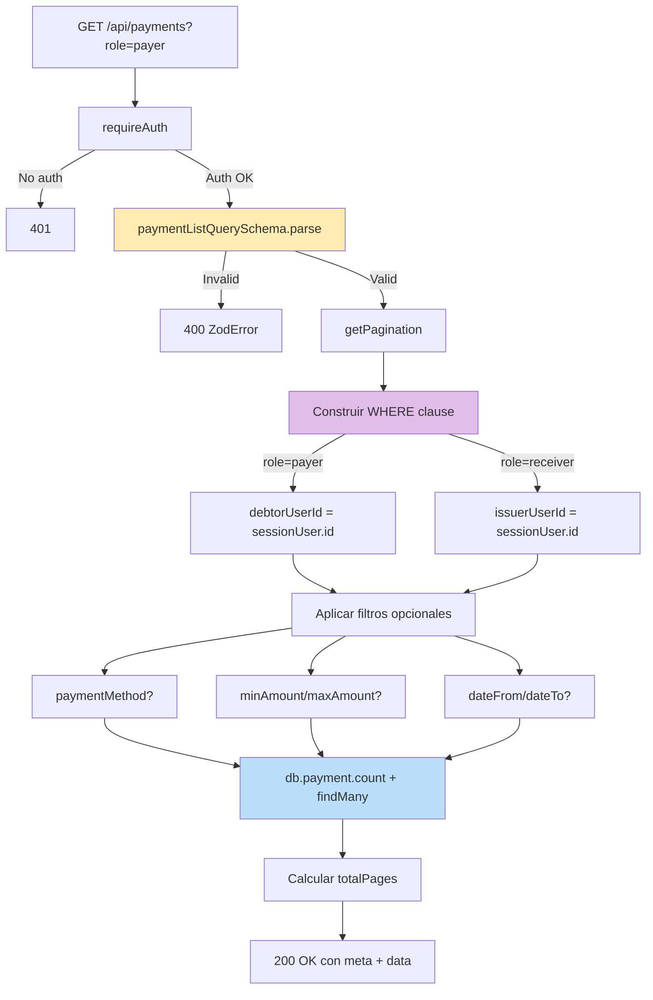

### Diagrama 5: Flujo de PayPal Payout

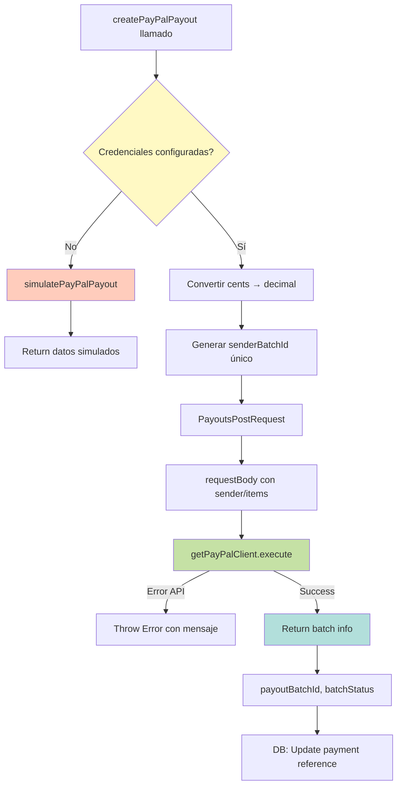

### Diagrama 6: Flujo de Autorización en GET /payments/:id

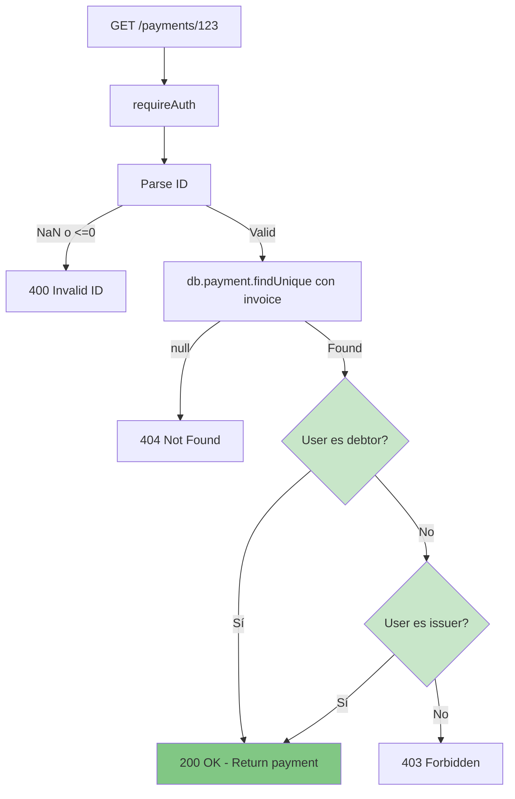

### Diagrama 7: Estados de Invoice y Payment

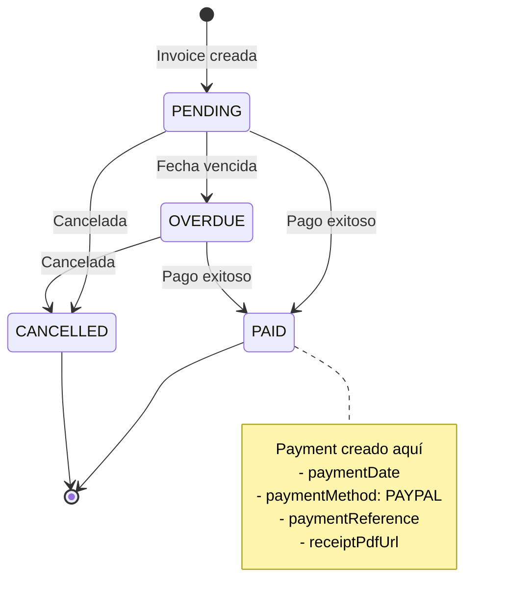

### Diagrama 8: Flujo Temporal del Sistema

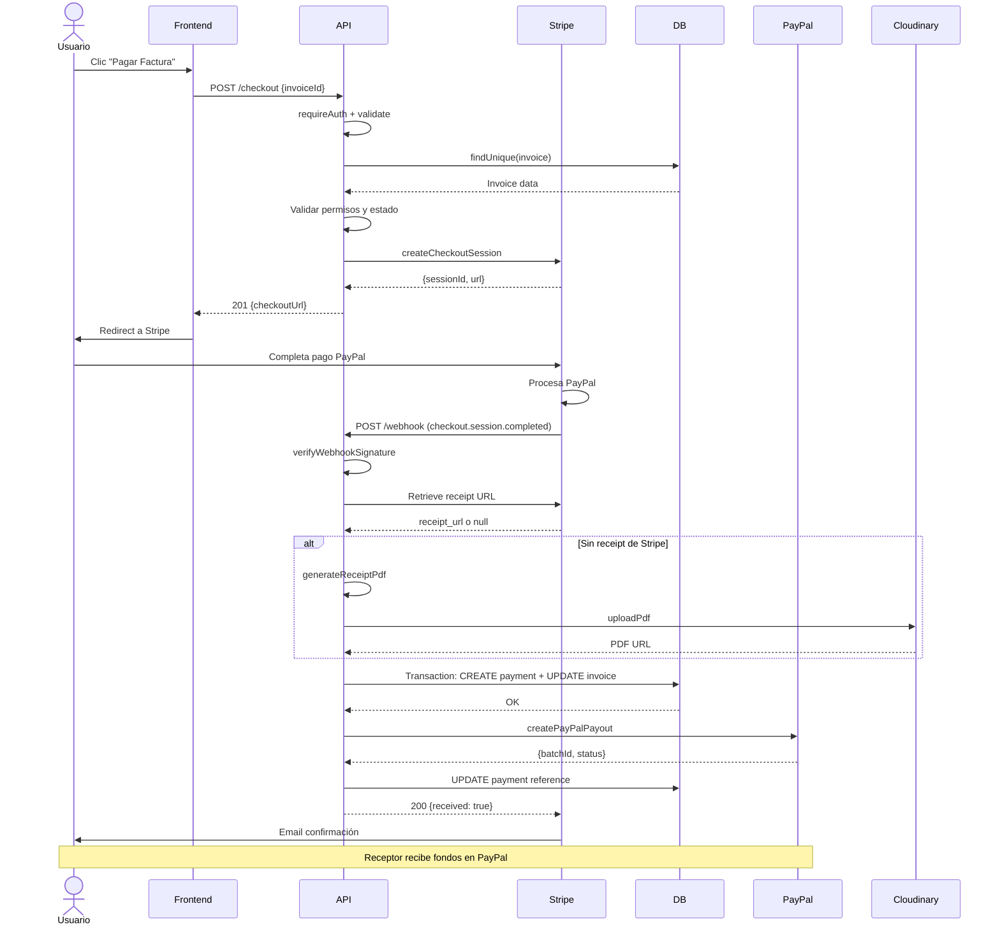

---

## Validaciones y Seguridad

### Matriz de Validaciones

| Endpoint | Tipo | Validador | Campos Validados |
|----------|------|-----------|------------------|
| GET /payments | Query Params | `paymentListQuerySchema` | role, paymentMethod, amounts, dates, sort |
| GET /payments/:id | Path Param | Manual | ID numérico positivo |
| GET /payments/:id | Authorization | Manual | debtorUserId o issuerUserId === sessionUser.id |
| POST /checkout | Body | `stripeCheckoutCreateSchema` | invoiceId, successUrl, cancelUrl |
| POST /checkout | Authorization | Manual | debtorUserId === sessionUser.id |
| POST /checkout | Business | Manual | !payment, status PENDING/OVERDUE |
| GET /session/:sessionId | Path Param | Manual | sessionId format "cs_*" |
| GET /session/:sessionId | Authorization | Manual | payerId o receiverId === sessionUser.id |
| POST /webhook | Signature | `verifyWebhookSignature` | HMAC SHA-256 con webhook secret |
| POST /webhook | Idempotency | DB query | Payment no debe existir |

### Esquemas Zod Completos

```typescript
// paymentListQuerySchema
{
  role: enum(['payer', 'receiver']).default('payer'),
  paymentMethod: enum(PaymentMethod).optional(),
  minAmount: number().nonnegative().optional(),
  maxAmount: number().nonnegative().optional(),
  paymentDateFrom: string().datetime().optional(),
  paymentDateTo: string().datetime().optional(),
  sortBy: enum(['paymentDate', 'createdAt']).default('paymentDate'),
  sortOrder: enum(['asc', 'desc']).default('desc')
}
// + superRefine: minAmount <= maxAmount, dateFrom <= dateTo

// stripeCheckoutCreateSchema
{
  invoiceId: number().int().positive(),
  successUrl: url().optional(),
  cancelUrl: url().optional()
}
```

### Niveles de Seguridad

#### Nivel 1: Autenticación (requireAuth)
```typescript
const session = await getServerSession(authOptions);
if (!session?.user?.id) throw new Error('Unauthorized');
```

#### Nivel 2: Validación de Entrada (Zod)
```typescript
const parsed = schema.parse(data);
// Throws ZodError si inválido
```

#### Nivel 3: Autorización (Business Logic)
```typescript
if (invoice.debtorUserId !== sessionUser.id) {
  throw new Error('Forbidden');
}
```

#### Nivel 4: Webhook Signature Verification
```typescript
const event = stripe.webhooks.constructEvent(
  payload,
  signature,
  webhookSecret
);
// Verifica HMAC para prevenir ataques
```

---

## Manejo de Errores

### Jerarquía de Error Handling

```typescript
// handleError() en api-helpers.ts
export function handleError(error: unknown) {
  if (error instanceof ZodError) {
    return NextResponse.json(
      { errors: error.issues },
      { status: 400 }
    );
  }
  
  if (error instanceof Error) {
    if (error.message === 'Unauthorized') {
      return NextResponse.json(
        { error: 'Unauthorized' },
        { status: 401 }
      );
    }
    
    if (error.message === 'Forbidden') {
      return NextResponse.json(
        { message: 'Forbidden' },
        { status: 403 }
      );
    }
    
    return NextResponse.json(
      { error: error.message },
      { status: 500 }
    );
  }
  
  return NextResponse.json(
    { error: 'Internal server error' },
    { status: 500 }
  );
}
```

### Tabla de Códigos de Error

| Código | Tipo | Causa Común | Respuesta |
|--------|------|-------------|-----------|
| 400 | Bad Request | Validación Zod, ID inválido, estado incorrecto | `{ errors: [...] }` o `{ message: "..." }` |
| 401 | Unauthorized | Sin sesión, JWT inválido | `{ error: "Unauthorized" }` |
| 403 | Forbidden | No es el debtor/issuer | `{ message: "Forbidden" }` |
| 404 | Not Found | Payment/Invoice no existe | `{ message: "... not found" }` |
| 500 | Internal Error | Error DB, Stripe API, PayPal API | `{ error: "..." }` |

### Estrategias de Recuperación

#### 1. Reintentos Automáticos (Stripe Webhook)
- Stripe reintenta automáticamente webhooks fallidos
- Exponential backoff hasta 3 días
- Implementar idempotencia para evitar duplicados

#### 2. Fallbacks
```typescript
// Recibo PDF
let receiptUrl = '';
try {
  receiptUrl = await getStripeReceipt();
} catch {
  receiptUrl = await generateAndUploadPDF();
}
if (!receiptUrl) {
  receiptUrl = 'unavailable'; // Fallback final
}
```

#### 3. Logging y Monitoreo
```typescript
console.error('[Stripe Webhook] Error:', error);
console.log('[PayPal Payout] Success:', result);
// TODO: Integrar con servicio de logging (Sentry, DataDog)
```

#### 4. Transacciones DB
```typescript
await db.$transaction(async (tx) => {
  await tx.payment.create(...);
  await tx.invoice.update(...);
});
// Si cualquier operación falla, rollback automático
```

---

## Referencias de API

### Endpoints Disponibles

| Método | Ruta | Descripción | Auth | Body/Params |
|--------|------|-------------|------|-------------|
| GET | `/api/payments` | Listar pagos paginados | ✅ | Query params |
| GET | `/api/payments/:id` | Detalle de pago | ✅ | Path param: id |
| POST | `/api/payments/stripe/checkout` | Crear sesión Stripe | ✅ | Body: invoiceId, urls |
| GET | `/api/payments/stripe/session/:sessionId` | Estado de sesión | ✅ | Path param: sessionId |
| POST | `/api/payments/stripe/webhook` | Webhook de Stripe | ❌ | Event payload |

### Variables de Entorno Requeridas

```env
# Stripe
STRIPE_SECRET_KEY=sk_test_...
STRIPE_WEBHOOK_SECRET=whsec_...
FRONTEND_URL=http://localhost:80

# PayPal
PAYPAL_CLIENT_ID=...
PAYPAL_CLIENT_SECRET=...
PAYPAL_MODE=sandbox  # o 'live'

# Cloudinary
CLOUDINARY_CLOUD_NAME=...
CLOUDINARY_API_KEY=...
CLOUDINARY_API_SECRET=...

# NextAuth
NEXTAUTH_SECRET=...
NEXTAUTH_URL=http://localhost:3000
```

### Librerías Principales

```json
{
  "stripe": "^17.4.0",
  "@paypal/payouts-sdk": "^1.1.1",
  "@prisma/client": "^6.1.0",
  "next-auth": "^4.24.0",
  "zod": "^3.23.0",
  "pdfkit": "^0.15.2",
  "cloudinary": "^2.5.1"
}
```

### Tipos TypeScript Importantes

```typescript
// Metadata de sesión Stripe
interface StripePaymentMetadata {
  invoiceId: string;
  payerId: string;
  receiverId: string;
  invoiceNumber: string;
  payerEmail: string;
  receiverEmail: string;
}

// Resultado de payout PayPal
interface PayPalPayoutResult {
  payoutBatchId: string;
  batchStatus: string;
  payoutItemId?: string;
  transactionId?: string;
  transactionStatus?: string;
  error?: string;
}

// Estados de sesión Stripe
type StripeSessionStatus = 
  | 'pending'
  | 'processing'
  | 'completed'
  | 'failed'
  | 'expired'
  | 'canceled';
```

---

## Diagramas Adicionales: Casos de Error

### Diagrama 9: Flujo de Pago Fallido

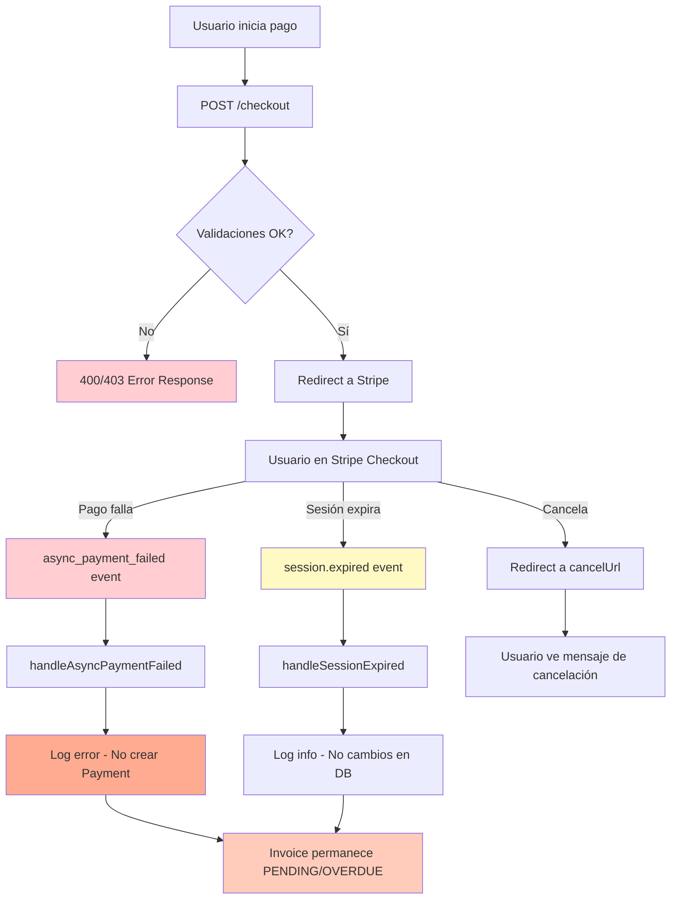

### Diagrama 10: Flujo de PayPal Payout Fallido

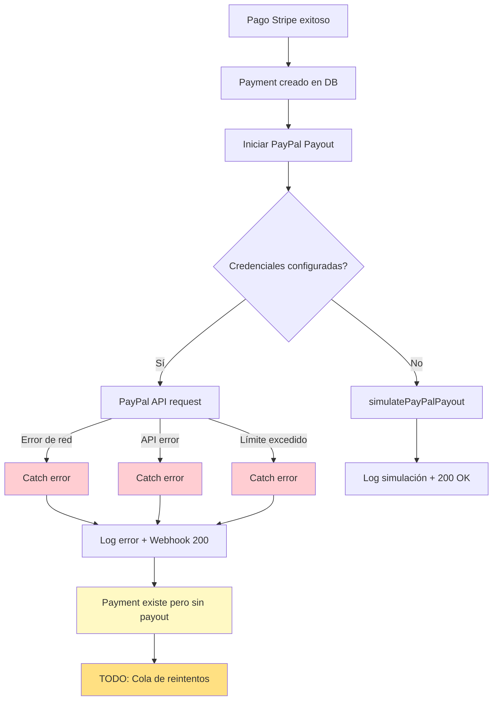

### Diagrama 11: Manejo de Errores en Generación de Recibo

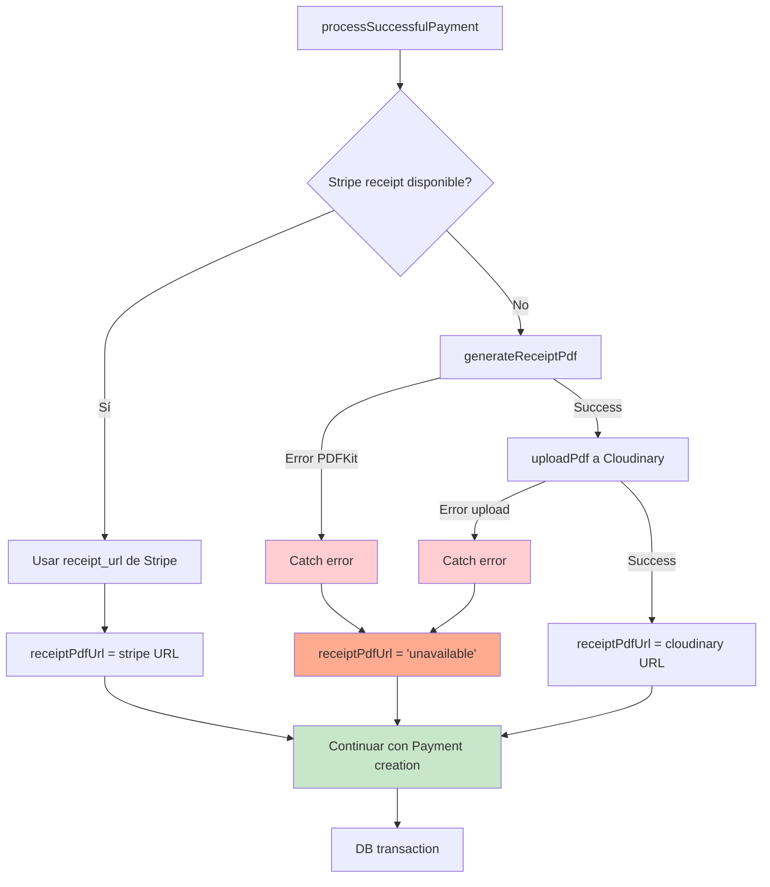

---

## Resumen de Integraciones

### Diagrama 12: Mapa de Integraciones

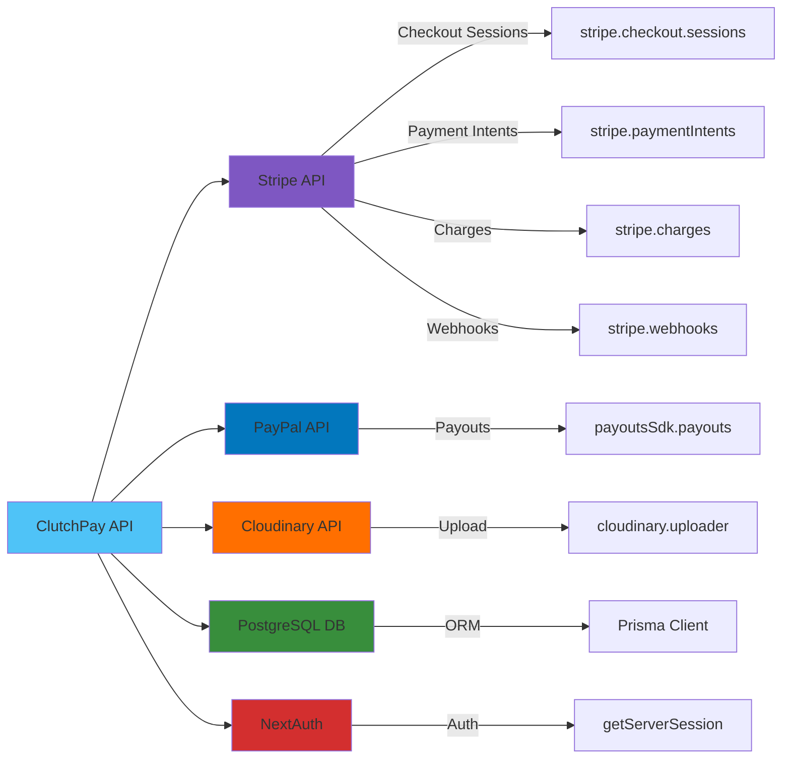

---

## Conclusión

Este sistema de pagos implementa:

✅ **Autenticación robusta** con NextAuth  
✅ **Validación exhaustiva** con Zod  
✅ **Transacciones atómicas** con Prisma  
✅ **Webhooks seguros** con verificación de firma  
✅ **Manejo de errores** con múltiples niveles de fallback  
✅ **Idempotencia** para prevenir duplicados  
✅ **Logging** para debugging y monitoreo  
✅ **Integración completa** Stripe + PayPal  

**Flujo principal**: Usuario → Stripe Checkout → Webhook → DB → PayPal Payout → Receptor

---

*Documentación generada el 9 de diciembre de 2025*  
*Versión: 1.0*  
*Proyecto: ClutchPay - Pasarela de Pagos*
