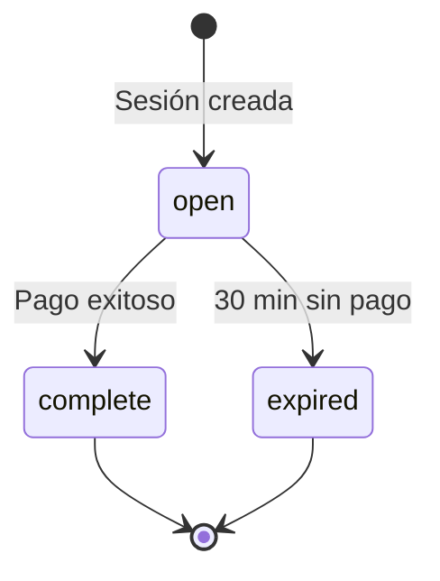

# Guía de Implementación: Pagos con Stripe/PayPal en JavaScript Vanilla

## Tabla de Contenidos

1. [Introducción](#introducción)
2. [Requisitos Previos](#requisitos-previos)
3. [Configuración del Entorno](#configuración-del-entorno)
4. [Autenticación con NextAuth](#autenticación-con-nextauth)
5. [Implementación del Flujo de Pagos](#implementación-del-flujo-de-pagos)
6. [Manejo de Redirecciones](#manejo-de-redirecciones)
7. [Consideraciones de Stripe](#consideraciones-de-stripe)
8. [Consideraciones de PayPal](#consideraciones-de-paypal)
9. [Código Completo de Ejemplo](#código-completo-de-ejemplo)
10. [Errores Comunes y Soluciones](#errores-comunes-y-soluciones)
11. [Checklist de Producción](#checklist-de-producción)

---

## Introducción

Esta guía explica cómo implementar el flujo de pagos de ClutchPay desde un frontend en **JavaScript Vanilla** (sin frameworks). El sistema utiliza:

- **Stripe Checkout** como procesador de pagos
- **PayPal** como único método de pago disponible (a través de Stripe)
- **NextAuth.js** para autenticación basada en sesiones
- **Cookies** para mantener el estado de autenticación

### Flujo General

```
┌─────────────────┐     ┌─────────────────┐     ┌─────────────────┐
│  Tu Frontend    │────▶│  Backend API    │────▶│  Stripe/PayPal  │
│  (JS Vanilla)   │     │  (Next.js)      │     │  (Procesador)   │
└─────────────────┘     └─────────────────┘     └─────────────────┘
        │                       │                       │
        │  1. POST /checkout    │                       │
        │──────────────────────▶│  2. Crear sesión      │
        │                       │──────────────────────▶│
        │  3. Return URL        │                       │
        │◀──────────────────────│                       │
        │                       │                       │
        │  4. Redirect user     │                       │
        │──────────────────────────────────────────────▶│
        │                       │                       │
        │                       │  5. Webhook callback  │
        │                       │◀──────────────────────│
        │  6. User redirected   │                       │
        │◀──────────────────────────────────────────────│
```

---

## Requisitos Previos

### Variables de Entorno Backend

```bash
# Stripe (OBLIGATORIO)
STRIPE_SECRET_KEY=sk_test_xxx           # Clave secreta de Stripe
STRIPE_WEBHOOK_SECRET=whsec_xxx         # Secreto para webhooks
NEXT_PUBLIC_APP_URL=http://localhost:3000

# PayPal (OPCIONAL - para payouts)
PAYPAL_CLIENT_ID=xxx
PAYPAL_CLIENT_SECRET=xxx
PAYPAL_MODE=sandbox                     # 'sandbox' o 'live'

# NextAuth (OBLIGATORIO)
NEXTAUTH_SECRET=tu-secreto-seguro
NEXTAUTH_URL=http://localhost:3000
```

### Estructura de Archivos Frontend

```
frontend/
├── JS/
│   ├── config.js           # Configuración de URLs
│   ├── auth.js             # Manejo de autenticación
│   ├── payments.js         # ← NUEVO: Módulo de pagos
│   └── dashboard/
│       └── invoices.js     # Listado de facturas
├── payments-success.html   # ← NUEVO: Página de éxito
├── payments-cancel.html    # ← NUEVO: Página de cancelación
└── dashboard.html          # Dashboard principal
```

---

## Configuración del Entorno

### config.js - Configuración Base

```javascript
/**
 * Configuración del Frontend
 * 
 * Define las URLs del backend y frontend para las llamadas API
 * y las redirecciones de Stripe.
 */

// Configuración del backend
const BACKEND_IP = 'localhost';  // Cambiar en producción
const BACKEND_PORT = 3000;

/**
 * Obtiene la URL base de la API
 * @returns {string} URL del backend
 */
function getApiBaseUrl() {
    // En producción, usar HTTPS
    const protocol = window.location.protocol === 'https:' ? 'https' : 'http';
    return `${protocol}://${BACKEND_IP}:${BACKEND_PORT}`;
}

/**
 * Obtiene la URL base del frontend
 * @returns {string} URL del frontend
 */
function getFrontendBaseUrl() {
    return window.location.origin;
}

// Configuración global accesible desde cualquier script
window.CLUTCHPAY_CONFIG = {
    API_BASE_URL: getApiBaseUrl(),
    FRONTEND_URL: getFrontendBaseUrl(),
    
    // URLs de redirección para Stripe
    PAYMENT_SUCCESS_URL: `${getFrontendBaseUrl()}/payments-success.html`,
    PAYMENT_CANCEL_URL: `${getFrontendBaseUrl()}/payments-cancel.html`,
};

console.log('[Config] API URL:', window.CLUTCHPAY_CONFIG.API_BASE_URL);
console.log('[Config] Frontend URL:', window.CLUTCHPAY_CONFIG.FRONTEND_URL);
```

### Importancia de las URLs

> ⚠️ **CRÍTICO**: Las URLs de `successUrl` y `cancelUrl` que envías al backend DEBEN:
> 1. Ser URLs absolutas (no relativas)
> 2. Ser accesibles públicamente (en producción)
> 3. Usar HTTPS en producción
> 4. Pertenecer a tu dominio (por seguridad)

---

## Autenticación con NextAuth

### Conceptos Clave

NextAuth.js usa **cookies de sesión** para mantener el estado de autenticación. Esto significa que:

1. **Las cookies se envían automáticamente** con cada request si usas `credentials: 'include'`
2. **CORS debe estar configurado** correctamente en el backend
3. **El dominio de las cookies** debe coincidir entre frontend y backend

### Clase Auth - Implementación Completa

```javascript
/**
 * Clase de Autenticación para ClutchPay
 * 
 * Maneja login, logout, y verificación de sesión usando NextAuth.js
 */
class Auth {
    constructor() {
        this.currentUser = null;
        this.API_BASE_URL = window.CLUTCHPAY_CONFIG?.API_BASE_URL || 'http://localhost:3000';
    }

    /**
     * Verifica si hay una sesión activa
     * 
     * IMPORTANTE: Esta función debe llamarse antes de cualquier
     * operación que requiera autenticación.
     * 
     * @returns {Promise<Object|null>} Usuario actual o null
     */
    async checkSession() {
        try {
            const response = await fetch(`${this.API_BASE_URL}/api/auth/session`, {
                method: 'GET',
                credentials: 'include',  // ⚠️ CRÍTICO: Envía cookies
            });

            if (response.ok) {
                const session = await response.json();
                this.currentUser = session?.user || null;
                return this.currentUser;
            }
            
            this.currentUser = null;
            return null;
        } catch (error) {
            console.error('[Auth] Error checking session:', error);
            this.currentUser = null;
            return null;
        }
    }

    /**
     * Inicia sesión con email y contraseña
     * 
     * Proceso:
     * 1. Obtiene CSRF token (protección contra ataques)
     * 2. Envía credenciales con el token
     * 3. Verifica que la sesión se creó correctamente
     * 
     * @param {string} email - Email del usuario
     * @param {string} password - Contraseña
     * @returns {Promise<{ok: boolean, error?: string}>}
     */
    async login(email, password) {
        try {
            // 1. Obtener CSRF token
            const csrfResponse = await fetch(`${this.API_BASE_URL}/api/auth/csrf`, {
                credentials: 'include',
            });
            const { csrfToken } = await csrfResponse.json();

            // 2. Enviar credenciales
            // ⚠️ IMPORTANTE: Usar application/x-www-form-urlencoded
            // para evitar problemas con CORS preflight
            const response = await fetch(`${this.API_BASE_URL}/api/auth/callback/credentials`, {
                method: 'POST',
                headers: {
                    'Content-Type': 'application/x-www-form-urlencoded',
                },
                body: new URLSearchParams({
                    csrfToken,
                    email,
                    password,
                    callbackUrl: `${this.API_BASE_URL}/api/auth/session`,
                    json: 'true',
                }),
                credentials: 'include',
            });

            const result = await response.json();

            if (result.error) {
                return { ok: false, error: 'Credenciales incorrectas' };
            }

            // 3. Verificar sesión
            // Pequeño delay para asegurar que la cookie se guardó
            await new Promise(resolve => setTimeout(resolve, 100));
            const session = await this.checkSession();
            
            return session ? { ok: true } : { ok: false, error: 'Error al crear sesión' };
        } catch (error) {
            console.error('[Auth] Login error:', error);
            return { ok: false, error: 'Error de conexión' };
        }
    }

    /**
     * Cierra la sesión actual
     */
    async logout() {
        try {
            // Obtener CSRF token
            const csrfResponse = await fetch(`${this.API_BASE_URL}/api/auth/csrf`, {
                credentials: 'include',
            });
            const { csrfToken } = await csrfResponse.json();

            // Cerrar sesión
            await fetch(`${this.API_BASE_URL}/api/auth/signout`, {
                method: 'POST',
                headers: {
                    'Content-Type': 'application/x-www-form-urlencoded',
                },
                body: new URLSearchParams({
                    csrfToken,
                    callbackUrl: window.location.origin,
                }),
                credentials: 'include',
            });

            this.currentUser = null;
            window.location.replace('/index.html');
        } catch (error) {
            console.error('[Auth] Logout error:', error);
            // Forzar redirección de todos modos
            window.location.replace('/index.html');
        }
    }

    /**
     * Verifica si el usuario está autenticado
     * @returns {boolean}
     */
    isAuthenticated() {
        return this.currentUser !== null;
    }

    /**
     * Redirige a login si no hay sesión activa
     */
    async requireAuth() {
        const user = await this.checkSession();
        if (!user) {
            window.location.replace('/login.html');
            return false;
        }
        return true;
    }
}

// Exportar instancia global
window.auth = new Auth();
```

### Notas sobre Autenticación

| Aspecto | Detalle |
|---------|---------|
| **CSRF Token** | Siempre obtenerlo antes de login/logout. Es único por sesión. |
| **credentials: 'include'** | OBLIGATORIO en todas las llamadas autenticadas |
| **Content-Type** | Usar `application/x-www-form-urlencoded` para login (evita preflight CORS) |
| **Cookies** | Son HttpOnly, no accesibles desde JS (más seguro) |
| **Verificación** | Siempre llamar `checkSession()` después de login |

---

## Implementación del Flujo de Pagos

### Clase PaymentManager - Módulo Completo

```javascript
/**
 * PaymentManager - Gestión de Pagos con Stripe
 * 
 * Este módulo maneja todo el flujo de pagos:
 * - Crear sesiones de checkout
 * - Consultar estado de sesiones
 * - Listar pagos del usuario
 * - Obtener detalle de un pago
 */
class PaymentManager {
    /**
     * Constructor
     * @param {Auth} authInstance - Instancia de Auth para obtener API_BASE_URL
     */
    constructor(authInstance) {
        this.auth = authInstance;
        this.API_BASE_URL = authInstance.API_BASE_URL;
    }

    /**
     * ═══════════════════════════════════════════════════════════════
     * CREAR SESIÓN DE CHECKOUT (Iniciar Pago)
     * ═══════════════════════════════════════════════════════════════
     * 
     * Este es el método principal para iniciar un pago.
     * 
     * @param {number} invoiceId - ID de la factura a pagar
     * @param {Object} options - Opciones adicionales
     * @param {string} options.successUrl - URL de redirección tras éxito
     * @param {string} options.cancelUrl - URL de redirección si cancela
     * @returns {Promise<{success: boolean, checkoutUrl?: string, error?: string}>}
     * 
     * @example
     * const result = await paymentManager.createCheckoutSession(123);
     * if (result.success) {
     *     window.location.href = result.checkoutUrl; // Redirigir a Stripe
     * }
     */
    async createCheckoutSession(invoiceId, options = {}) {
        try {
            // Configurar URLs de redirección
            // ⚠️ IMPORTANTE: Deben ser URLs absolutas
            const config = window.CLUTCHPAY_CONFIG || {};
            const successUrl = options.successUrl || config.PAYMENT_SUCCESS_URL 
                || `${window.location.origin}/payments-success.html`;
            const cancelUrl = options.cancelUrl || config.PAYMENT_CANCEL_URL 
                || `${window.location.origin}/payments-cancel.html`;

            console.log('[Payment] Creating checkout session for invoice:', invoiceId);
            console.log('[Payment] Success URL:', successUrl);
            console.log('[Payment] Cancel URL:', cancelUrl);

            // Llamada a la API
            const response = await fetch(`${this.API_BASE_URL}/api/payments/stripe/checkout`, {
                method: 'POST',
                headers: {
                    'Content-Type': 'application/json',
                },
                body: JSON.stringify({
                    invoiceId: invoiceId,
                    successUrl: successUrl,
                    cancelUrl: cancelUrl,
                }),
                credentials: 'include',  // ⚠️ CRÍTICO: Envía cookies de sesión
            });

            // Manejar errores HTTP
            if (!response.ok) {
                const errorData = await response.json().catch(() => ({}));
                console.error('[Payment] Checkout error:', response.status, errorData);
                
                return {
                    success: false,
                    error: this.getErrorMessage(response.status, errorData),
                };
            }

            // Parsear respuesta exitosa
            const data = await response.json();
            
            console.log('[Payment] Checkout session created:', data.sessionId);

            return {
                success: true,
                sessionId: data.sessionId,
                checkoutUrl: data.checkoutUrl,
                invoice: data.invoice,
            };
        } catch (error) {
            console.error('[Payment] Network error:', error);
            return {
                success: false,
                error: 'Error de conexión. Por favor, inténtalo de nuevo.',
            };
        }
    }

    /**
     * ═══════════════════════════════════════════════════════════════
     * CONSULTAR ESTADO DE SESIÓN
     * ═══════════════════════════════════════════════════════════════
     * 
     * Útil para verificar el estado de un pago después de la redirección.
     * 
     * @param {string} sessionId - ID de sesión de Stripe (cs_xxx)
     * @returns {Promise<Object>} Estado de la sesión
     * 
     * Estados posibles:
     * - 'pending': Esperando pago
     * - 'processing': Pago en proceso
     * - 'completed': Pago exitoso
     * - 'failed': Pago fallido
     * - 'expired': Sesión expirada
     */
    async getSessionStatus(sessionId) {
        try {
            // Validar formato de sessionId
            if (!sessionId || !sessionId.startsWith('cs_')) {
                return {
                    success: false,
                    error: 'ID de sesión inválido',
                };
            }

            const response = await fetch(
                `${this.API_BASE_URL}/api/payments/stripe/session/${sessionId}`,
                {
                    method: 'GET',
                    credentials: 'include',
                }
            );

            if (!response.ok) {
                const errorData = await response.json().catch(() => ({}));
                return {
                    success: false,
                    error: this.getErrorMessage(response.status, errorData),
                };
            }

            const data = await response.json();
            
            return {
                success: true,
                sessionId: data.sessionId,
                status: data.status,
                paymentStatus: data.paymentStatus,
                amount: data.amount,
                currency: data.currency,
                invoice: data.invoice,
            };
        } catch (error) {
            console.error('[Payment] Error getting session status:', error);
            return {
                success: false,
                error: 'Error de conexión',
            };
        }
    }

    /**
     * ═══════════════════════════════════════════════════════════════
     * LISTAR PAGOS DEL USUARIO
     * ═══════════════════════════════════════════════════════════════
     * 
     * Obtiene la lista paginada de pagos del usuario autenticado.
     * 
     * @param {Object} options - Opciones de filtrado
     * @param {string} options.role - 'payer' (pagos hechos) o 'receiver' (pagos recibidos)
     * @param {string} options.paymentMethod - PAYPAL, VISA, MASTERCARD, OTHER
     * @param {number} options.page - Número de página (default: 1)
     * @param {number} options.limit - Items por página (default: 10)
     * @returns {Promise<Object>} Lista paginada de pagos
     */
    async listPayments(options = {}) {
        try {
            // Construir query params
            const params = new URLSearchParams();
            
            if (options.role) params.append('role', options.role);
            if (options.paymentMethod) params.append('paymentMethod', options.paymentMethod);
            if (options.page) params.append('page', options.page.toString());
            if (options.limit) params.append('limit', options.limit.toString());
            if (options.sortBy) params.append('sortBy', options.sortBy);
            if (options.sortOrder) params.append('sortOrder', options.sortOrder);

            const url = `${this.API_BASE_URL}/api/payments?${params.toString()}`;
            
            const response = await fetch(url, {
                method: 'GET',
                credentials: 'include',
            });

            if (!response.ok) {
                const errorData = await response.json().catch(() => ({}));
                return {
                    success: false,
                    error: this.getErrorMessage(response.status, errorData),
                };
            }

            const data = await response.json();
            
            return {
                success: true,
                meta: data.meta,      // { total, totalPages, page, limit, nextPage, prevPage }
                payments: data.data,  // Array de pagos
            };
        } catch (error) {
            console.error('[Payment] Error listing payments:', error);
            return {
                success: false,
                error: 'Error de conexión',
            };
        }
    }

    /**
     * ═══════════════════════════════════════════════════════════════
     * OBTENER DETALLE DE PAGO
     * ═══════════════════════════════════════════════════════════════
     * 
     * Obtiene información detallada de un pago específico.
     * Solo el pagador o receptor pueden acceder.
     * 
     * @param {number} paymentId - ID del pago
     * @returns {Promise<Object>} Detalle del pago
     */
    async getPaymentDetail(paymentId) {
        try {
            const response = await fetch(
                `${this.API_BASE_URL}/api/payments/${paymentId}`,
                {
                    method: 'GET',
                    credentials: 'include',
                }
            );

            if (!response.ok) {
                const errorData = await response.json().catch(() => ({}));
                return {
                    success: false,
                    error: this.getErrorMessage(response.status, errorData),
                };
            }

            const payment = await response.json();
            
            return {
                success: true,
                payment: payment,
            };
        } catch (error) {
            console.error('[Payment] Error getting payment detail:', error);
            return {
                success: false,
                error: 'Error de conexión',
            };
        }
    }

    /**
     * Convierte códigos de error HTTP a mensajes amigables
     * @private
     */
    getErrorMessage(statusCode, errorData) {
        const messages = {
            400: errorData.message || 'Datos inválidos',
            401: 'Sesión expirada. Por favor, inicia sesión de nuevo.',
            403: 'No tienes permiso para realizar esta acción',
            404: 'Recurso no encontrado',
            500: 'Error del servidor. Inténtalo más tarde.',
        };
        
        return messages[statusCode] || errorData.message || 'Error desconocido';
    }
}

// Exportar globalmente
window.PaymentManager = PaymentManager;
```

---

## Manejo de Redirecciones

### Flujo de Redirección de Stripe

```
Usuario hace clic en "Pagar"
         │
         ▼
┌─────────────────────────────────────────┐
│ createCheckoutSession() llamado         │
│ - Envía invoiceId, successUrl, cancelUrl│
└─────────────────────────────────────────┘
         │
         ▼
┌─────────────────────────────────────────┐
│ Backend crea sesión en Stripe           │
│ - Retorna checkoutUrl                   │
└─────────────────────────────────────────┘
         │
         ▼
┌─────────────────────────────────────────┐
│ Frontend redirige a Stripe Checkout     │
│ window.location.href = checkoutUrl      │
│                                         │
│ ⚠️ El usuario SALE de tu sitio         │
└─────────────────────────────────────────┘
         │
         ├──── Usuario completa pago ────────▶ Redirect a successUrl
         │                                      con ?session_id=cs_xxx
         │
         └──── Usuario cancela ──────────────▶ Redirect a cancelUrl
                                                con ?invoice_id=xxx
```

### Página de Éxito (payments-success.html)

```html
<!DOCTYPE html>
<html lang="es">
<head>
    <meta charset="UTF-8">
    <meta name="viewport" content="width=device-width, initial-scale=1.0">
    <title>Pago Exitoso - ClutchPay</title>
    <link rel="stylesheet" href="CSS/styles.css">
</head>
<body>
    <div class="payment-result-container">
        <div id="loading-state" class="payment-state">
            <div class="spinner"></div>
            <h1>Procesando pago...</h1>
            <p>Por favor, espera mientras confirmamos tu pago.</p>
        </div>
        
        <div id="success-state" class="payment-state" style="display: none;">
            <div class="success-icon">✓</div>
            <h1>¡Pago Completado!</h1>
            <p id="payment-details"></p>
            <div class="payment-info" id="payment-info"></div>
            <button onclick="window.location.href='main.html'" class="btn btn-primary">
                Volver al Dashboard
            </button>
        </div>
        
        <div id="pending-state" class="payment-state" style="display: none;">
            <div class="pending-icon">⏳</div>
            <h1>Pago en Proceso</h1>
            <p>Tu pago está siendo procesado. Recibirás una confirmación pronto.</p>
            <button onclick="window.location.href='main.html'" class="btn btn-primary">
                Volver al Dashboard
            </button>
        </div>
        
        <div id="error-state" class="payment-state" style="display: none;">
            <div class="error-icon">✗</div>
            <h1>Error</h1>
            <p id="error-message">Ha ocurrido un error verificando el pago.</p>
            <button onclick="window.location.href='main.html'" class="btn btn-secondary">
                Volver al Dashboard
            </button>
        </div>
    </div>
    
    <script src="JS/config.js"></script>
    <script src="JS/auth.js"></script>
    <script src="JS/payments.js"></script>
    <script>
        /**
         * Script de página de éxito
         * 
         * 1. Obtiene session_id de la URL
         * 2. Verifica el estado del pago
         * 3. Muestra el resultado apropiado
         */
        (async function() {
            // Verificar autenticación
            const auth = new Auth();
            const isAuth = await auth.requireAuth();
            if (!isAuth) return;
            
            // Obtener session_id de la URL
            const urlParams = new URLSearchParams(window.location.search);
            const sessionId = urlParams.get('session_id');
            
            if (!sessionId) {
                showError('No se encontró información del pago');
                return;
            }
            
            // Verificar estado del pago
            const paymentManager = new PaymentManager(auth);
            const result = await paymentManager.getSessionStatus(sessionId);
            
            if (!result.success) {
                showError(result.error);
                return;
            }
            
            // Mostrar estado apropiado
            document.getElementById('loading-state').style.display = 'none';
            
            switch (result.status) {
                case 'completed':
                    document.getElementById('success-state').style.display = 'block';
                    document.getElementById('payment-details').textContent = 
                        `Factura #${result.invoice?.invoiceNumber || ''} pagada correctamente.`;
                    document.getElementById('payment-info').innerHTML = `
                        <p><strong>Monto:</strong> €${result.amount}</p>
                        <p><strong>Estado:</strong> Completado</p>
                    `;
                    break;
                    
                case 'pending':
                case 'processing':
                    document.getElementById('pending-state').style.display = 'block';
                    break;
                    
                default:
                    showError(`Estado del pago: ${result.status}`);
            }
            
            function showError(message) {
                document.getElementById('loading-state').style.display = 'none';
                document.getElementById('error-state').style.display = 'block';
                document.getElementById('error-message').textContent = message;
            }
        })();
    </script>
</body>
</html>
```

### Página de Cancelación (payments-cancel.html)

```html
<!DOCTYPE html>
<html lang="es">
<head>
    <meta charset="UTF-8">
    <meta name="viewport" content="width=device-width, initial-scale=1.0">
    <title>Pago Cancelado - ClutchPay</title>
    <link rel="stylesheet" href="CSS/styles.css">
</head>
<body>
    <div class="payment-result-container">
        <div class="cancel-icon">⚠️</div>
        <h1>Pago Cancelado</h1>
        <p>Has cancelado el proceso de pago. No se ha realizado ningún cargo.</p>
        
        <div id="invoice-info"></div>
        
        <div class="button-group">
            <button onclick="retryPayment()" class="btn btn-primary" id="retry-btn" style="display: none;">
                Intentar de nuevo
            </button>
            <button onclick="window.location.href='main.html'" class="btn btn-secondary">
                Volver al Dashboard
            </button>
        </div>
    </div>
    
    <script src="JS/config.js"></script>
    <script src="JS/auth.js"></script>
    <script src="JS/payments.js"></script>
    <script>
        let invoiceId = null;
        
        (async function() {
            // Obtener invoice_id de la URL (enviado por Stripe)
            const urlParams = new URLSearchParams(window.location.search);
            invoiceId = urlParams.get('invoice_id');
            
            if (invoiceId) {
                document.getElementById('invoice-info').innerHTML = 
                    `<p>Factura #${invoiceId}</p>`;
                document.getElementById('retry-btn').style.display = 'inline-block';
            }
        })();
        
        async function retryPayment() {
            if (!invoiceId) return;
            
            const auth = new Auth();
            const isAuth = await auth.requireAuth();
            if (!isAuth) return;
            
            const paymentManager = new PaymentManager(auth);
            const result = await paymentManager.createCheckoutSession(parseInt(invoiceId));
            
            if (result.success) {
                window.location.href = result.checkoutUrl;
            } else {
                alert('Error: ' + result.error);
            }
        }
    </script>
</body>
</html>
```

---

## Consideraciones de Stripe

### 1. Modos de Operación

| Modo | Uso | Claves |
|------|-----|--------|
| **Test** | Desarrollo y pruebas | `pk_test_xxx`, `sk_test_xxx` |
| **Live** | Producción | `pk_live_xxx`, `sk_live_xxx` |

> ⚠️ **NUNCA** mezcles claves de test y live. Verificar siempre el prefijo.

### 2. Tarjetas de Prueba

```
Número: 4242 4242 4242 4242
Fecha: Cualquier fecha futura
CVC: Cualquier 3 dígitos
ZIP: Cualquier código postal

Otras tarjetas de prueba:
- 4000 0000 0000 0002 → Tarjeta rechazada
- 4000 0000 0000 3220 → Requiere autenticación 3D Secure
```

### 3. Webhooks

```
Webhooks son CRÍTICOS para el funcionamiento correcto.
Sin webhooks, los pagos no se registran en la base de datos.
```

#### Configuración de Webhooks en Stripe Dashboard

1. Ir a **Developers → Webhooks**
2. **Add endpoint**: `https://tu-dominio.com/api/payments/stripe/webhook`
3. Seleccionar eventos:
   - `checkout.session.completed`
   - `checkout.session.expired`
   - `checkout.session.async_payment_succeeded`
   - `checkout.session.async_payment_failed`
4. Copiar el **Signing Secret** (`whsec_xxx`)
5. Agregarlo a variables de entorno como `STRIPE_WEBHOOK_SECRET`

#### Prueba Local con Stripe CLI

```bash
# Instalar Stripe CLI
# Windows (con scoop)
scoop install stripe

# Iniciar sesión
stripe login

# Redirigir webhooks a localhost
stripe listen --forward-to localhost:3000/api/payments/stripe/webhook

# Copiar el webhook secret que muestra y usarlo en .env
```

### 4. Sesiones de Checkout

| Propiedad | Valor | Descripción |
|-----------|-------|-------------|
| `expires_at` | +30 minutos | Tiempo máximo para completar el pago |
| `payment_method_types` | `['paypal']` | Solo PayPal habilitado |
| `mode` | `'payment'` | Pago único (no suscripción) |
| `metadata` | Invoice + User IDs | Datos para el webhook |

### 5. Estados de Sesión



### 6. Mejores Prácticas

1. **Siempre verificar el webhook** antes de actualizar la base de datos
2. **Nunca confiar solo en la redirección** de éxito (el usuario puede manipular la URL)
3. **Implementar idempotencia** para evitar pagos duplicados
4. **Loggear todo** para debugging
5. **Usar HTTPS** en producción (Stripe lo requiere para webhooks)

---

## Consideraciones de PayPal

### 1. Flujo de PayPal a través de Stripe

ClutchPay NO usa PayPal directamente para recibir pagos. El flujo es:

```
Usuario ──▶ Stripe Checkout ──▶ PayPal (como método de pago) ──▶ Stripe
                                                                    │
                                                                    ▼
                                                              Webhook ──▶ Backend
                                                                    │
                                                                    ▼
                                                              PayPal Payout ──▶ Receptor
```

### 2. PayPal Payouts (Transferencia al Receptor)

Los payouts se ejecutan automáticamente en el webhook después de un pago exitoso:

```javascript
// Esto ocurre en el backend (webhook)
await createPayPalPayout({
    receiverEmail: 'receptor@email.com',  // Email de PayPal del receptor
    amount: 9999,                          // En centavos
    currency: 'EUR',
    invoiceNumber: 'INV-001',
    senderId: 1,
    receiverId: 2,
});
```

### 3. Requisitos de PayPal

| Requisito | Detalle |
|-----------|---------|
| **Cuenta Business** | Necesaria para payouts |
| **API Credentials** | Client ID y Secret del dashboard |
| **Modo Sandbox** | Para pruebas (no dinero real) |
| **Email verificado** | El receptor debe tener PayPal |

### 4. Sandbox vs Live

```env
# Sandbox (Desarrollo)
PAYPAL_MODE=sandbox
PAYPAL_CLIENT_ID=sb-xxx
PAYPAL_CLIENT_SECRET=xxx

# Live (Producción)
PAYPAL_MODE=live
PAYPAL_CLIENT_ID=live-xxx
PAYPAL_CLIENT_SECRET=xxx
```

### 5. Cuentas de Prueba Sandbox

1. Ir a [PayPal Developer](https://developer.paypal.com/)
2. Crear cuentas sandbox (personal y business)
3. Usar esas cuentas para probar pagos

### 6. Posibles Errores de Payout

| Error | Causa | Solución |
|-------|-------|----------|
| `INSUFFICIENT_FUNDS` | Sin saldo en cuenta | Agregar fondos o simular |
| `INVALID_EMAIL` | Email no es cuenta PayPal | Verificar email del receptor |
| `RECEIVER_UNCONFIRMED` | Cuenta no verificada | Usuario debe verificar |
| `TRANSACTION_REFUSED` | Límites excedidos | Contactar soporte PayPal |

---

## Código Completo de Ejemplo

### Integración en el Dashboard

```javascript
/**
 * Ejemplo de integración del módulo de pagos en el dashboard
 * 
 * Este código muestra cómo usar PaymentManager en un contexto real.
 */

class DashboardPayments {
    constructor(core) {
        this.core = core;
        this.paymentManager = new PaymentManager(core.authInstance);
    }

    /**
     * Inicializa el módulo de pagos
     */
    init() {
        this.loadPayments();
        this.setupEventListeners();
    }

    /**
     * Carga y muestra los pagos del usuario
     */
    async loadPayments() {
        const container = document.getElementById('payments-list');
        if (!container) return;

        container.innerHTML = '<div class="loading">Cargando pagos...</div>';

        // Cargar pagos hechos y recibidos
        const [payerResult, receiverResult] = await Promise.all([
            this.paymentManager.listPayments({ role: 'payer', limit: 50 }),
            this.paymentManager.listPayments({ role: 'receiver', limit: 50 }),
        ]);

        if (!payerResult.success || !receiverResult.success) {
            container.innerHTML = '<div class="error">Error cargando pagos</div>';
            return;
        }

        const allPayments = [
            ...payerResult.payments.map(p => ({ ...p, type: 'sent' })),
            ...receiverResult.payments.map(p => ({ ...p, type: 'received' })),
        ];

        this.renderPayments(allPayments, container);
    }

    /**
     * Renderiza la lista de pagos
     */
    renderPayments(payments, container) {
        if (payments.length === 0) {
            container.innerHTML = '<div class="empty">No hay pagos</div>';
            return;
        }

        const html = payments.map(payment => `
            <div class="payment-card" data-payment-id="${payment.id}">
                <div class="payment-type ${payment.type}">
                    ${payment.type === 'sent' ? '📤 Enviado' : '📥 Recibido'}
                </div>
                <div class="payment-amount">€${parseFloat(payment.invoice?.amount || 0).toFixed(2)}</div>
                <div class="payment-date">${new Date(payment.paymentDate).toLocaleDateString()}</div>
                <div class="payment-invoice">#${payment.invoice?.invoiceNumber}</div>
            </div>
        `).join('');

        container.innerHTML = html;
    }

    /**
     * Configura event listeners
     */
    setupEventListeners() {
        // Delegación de eventos para botones de pago
        document.addEventListener('click', async (e) => {
            // Botón "Pagar" en tarjeta de factura
            if (e.target.classList.contains('pay-invoice-btn')) {
                const invoiceId = parseInt(e.target.dataset.invoiceId);
                await this.initiatePayment(invoiceId);
            }
            
            // Botón para ver detalle de pago
            if (e.target.closest('.payment-card')) {
                const paymentId = parseInt(e.target.closest('.payment-card').dataset.paymentId);
                await this.showPaymentDetail(paymentId);
            }
        });
    }

    /**
     * Inicia el proceso de pago para una factura
     * @param {number} invoiceId - ID de la factura
     */
    async initiatePayment(invoiceId) {
        // Mostrar loading
        this.core.showLoading('Preparando pago...');

        try {
            const result = await this.paymentManager.createCheckoutSession(invoiceId);

            if (!result.success) {
                this.core.hideLoading();
                this.core.showError(result.error);
                return;
            }

            // Redirigir a Stripe Checkout
            // ⚠️ IMPORTANTE: El usuario SALDRÁ de la página
            console.log('[Payment] Redirecting to Stripe:', result.checkoutUrl);
            window.location.href = result.checkoutUrl;
            
        } catch (error) {
            this.core.hideLoading();
            this.core.showError('Error inesperado. Por favor, inténtalo de nuevo.');
            console.error('[Payment] Error:', error);
        }
    }

    /**
     * Muestra el detalle de un pago en un modal
     * @param {number} paymentId - ID del pago
     */
    async showPaymentDetail(paymentId) {
        const result = await this.paymentManager.getPaymentDetail(paymentId);

        if (!result.success) {
            this.core.showError(result.error);
            return;
        }

        const payment = result.payment;
        
        // Crear modal con detalle
        const modalHTML = `
            <div class="modal-overlay" id="payment-modal">
                <div class="modal-content">
                    <button class="modal-close" onclick="this.closest('.modal-overlay').remove()">×</button>
                    
                    <h2>Detalle del Pago</h2>
                    
                    <div class="payment-detail-section">
                        <h3>Información del Pago</h3>
                        <p><strong>Fecha:</strong> ${new Date(payment.paymentDate).toLocaleString()}</p>
                        <p><strong>Método:</strong> ${payment.paymentMethod}</p>
                        <p><strong>Referencia:</strong> ${payment.paymentReference}</p>
                    </div>
                    
                    <div class="payment-detail-section">
                        <h3>Factura Asociada</h3>
                        <p><strong>Número:</strong> #${payment.invoice.invoiceNumber}</p>
                        <p><strong>Monto:</strong> €${parseFloat(payment.invoice.amount).toFixed(2)}</p>
                        <p><strong>Asunto:</strong> ${payment.invoice.subject}</p>
                    </div>
                    
                    ${payment.receiptPdfUrl && payment.receiptPdfUrl !== 'unavailable' ? `
                    <div class="payment-detail-section">
                        <h3>Recibo</h3>
                        <a href="${payment.receiptPdfUrl}" target="_blank" class="btn btn-primary">
                            📄 Ver Recibo PDF
                        </a>
                    </div>
                    ` : ''}
                </div>
            </div>
        `;

        document.body.insertAdjacentHTML('beforeend', modalHTML);
    }
}

// Integrar en el dashboard existente
if (typeof DashboardCore !== 'undefined') {
    DashboardCore.prototype.initPayments = function() {
        this.payments = new DashboardPayments(this);
        this.payments.init();
    };
}
```

### Añadir Botón de Pago a Facturas

```javascript
/**
 * Modificar el método showInvoiceModal para añadir botón de pago
 * (Añadir esto al final del modal HTML en DashboardInvoices)
 */

// Dentro de showInvoiceModal(), después del contenido del modal:
const payButtonHTML = invoice.type === 'received' && 
    (invoice.status === 'PENDING' || invoice.status === 'OVERDUE') ? `
    <div class="invoice-modal-section payment-section">
        <h3>Acciones</h3>
        <button class="btn btn-success pay-invoice-btn" data-invoice-id="${invoice.id}">
            💳 Pagar Ahora
        </button>
    </div>
` : '';

// Insertar antes del cierre del modal-content
```

---

## Errores Comunes y Soluciones

### 1. Error 401 Unauthorized

**Causa**: Sesión expirada o cookies no enviadas

**Soluciones**:
```javascript
// Asegurar que credentials: 'include' está en todas las llamadas
fetch(url, {
    credentials: 'include',  // ← OBLIGATORIO
});

// Verificar sesión antes de operaciones críticas
const session = await auth.checkSession();
if (!session) {
    window.location.href = '/login.html';
    return;
}
```

### 2. Error CORS

**Causa**: Dominio no permitido o headers incorrectos

**Soluciones**:
```javascript
// En el backend (Next.js), verificar next.config.ts o middleware
// El frontend debe estar en la lista de orígenes permitidos

// En desarrollo, asegurar que ambos usen el mismo puerto
// o configurar CORS correctamente
```

### 3. Webhook No Recibe Eventos

**Causa**: URL incorrecta o firma inválida

**Soluciones**:
```bash
# Verificar con Stripe CLI
stripe listen --forward-to localhost:3000/api/payments/stripe/webhook

# Revisar logs del webhook en Stripe Dashboard
# Developers → Webhooks → [Tu endpoint] → Logs
```

### 4. Pago Completado pero No Registrado

**Causa**: Webhook falló o no está configurado

**Soluciones**:
1. Verificar que el webhook está activo en Stripe
2. Revisar logs del servidor para errores
3. Verificar `STRIPE_WEBHOOK_SECRET` en variables de entorno
4. Asegurar que la URL del webhook es accesible públicamente

### 5. PayPal Payout Falla

**Causa**: Credenciales incorrectas o email inválido

**Soluciones**:
```bash
# Verificar credenciales
PAYPAL_CLIENT_ID=xxx
PAYPAL_CLIENT_SECRET=xxx
PAYPAL_MODE=sandbox

# Verificar que el email del receptor es una cuenta PayPal válida
```

### 6. Redirección No Funciona

**Causa**: URLs relativas o incorrectas

**Soluciones**:
```javascript
// Usar URLs absolutas
const successUrl = 'https://midominio.com/payments-success.html';
// NO: '/payments-success.html'

// Verificar que las páginas existen y son accesibles
```

---

## Checklist de Producción

### Backend

- [ ] `STRIPE_SECRET_KEY` es clave live (`sk_live_xxx`)
- [ ] `STRIPE_WEBHOOK_SECRET` es del webhook de producción
- [ ] `PAYPAL_MODE=live` y credenciales live
- [ ] `NEXT_PUBLIC_APP_URL` es el dominio de producción
- [ ] Webhook configurado con URL de producción
- [ ] HTTPS habilitado (obligatorio para webhooks)
- [ ] Base de datos de producción configurada
- [ ] Logs configurados para monitoreo

### Frontend

- [ ] `config.js` apunta al backend de producción
- [ ] URLs de éxito/cancelación son absolutas y correctas
- [ ] HTTPS en todos los recursos
- [ ] Manejo de errores robusto
- [ ] Loading states implementados
- [ ] Páginas de éxito y cancelación funcionan

### Stripe

- [ ] Cuenta en modo live
- [ ] PayPal habilitado como método de pago
- [ ] Webhook configurado y activo
- [ ] Eventos correctos seleccionados
- [ ] Probado con pago real pequeño

### PayPal

- [ ] Cuenta Business verificada
- [ ] Credenciales live en variables de entorno
- [ ] Probado payout real

### Seguridad

- [ ] Variables de entorno en archivos seguros (no en código)
- [ ] HTTPS obligatorio
- [ ] CORS configurado solo para dominios permitidos
- [ ] Rate limiting implementado
- [ ] Logging de errores activo

---

## Recursos Adicionales

### Documentación Oficial

- [Stripe Checkout](https://stripe.com/docs/payments/checkout)
- [Stripe Webhooks](https://stripe.com/docs/webhooks)
- [PayPal Payouts](https://developer.paypal.com/docs/payouts/)
- [NextAuth.js](https://next-auth.js.org/)

### Herramientas de Desarrollo

- [Stripe CLI](https://stripe.com/docs/stripe-cli) - Testing local
- [Stripe Dashboard](https://dashboard.stripe.com/) - Gestión
- [PayPal Sandbox](https://developer.paypal.com/developer/accounts/) - Testing

---

*Documentación generada el 9 de diciembre de 2025*  
*Versión: 1.0*  
*Proyecto: ClutchPay - Pasarela de Pagos*
